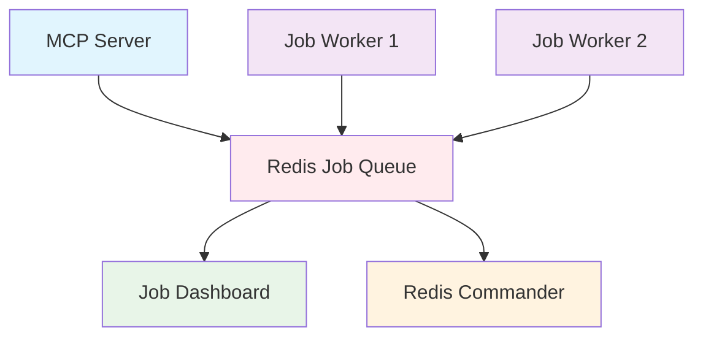

# 🚀 WhatsApp Flows API MCP Server

<div align="center">

[](https://www.docker.com/)
[](https://www.typescriptlang.org/)
[](https://redis.io/)
[](https://developers.facebook.com/docs/whatsapp/)

*A containerized Model Context Protocol (MCP) server for creating and managing WhatsApp surveys with ERP system integration*

</div>

---

## ✨ Features

- 🐳 **Dockerized Architecture** - Complete containerized setup with Redis and background processing
- 🔧 **Modular ERP Integration** - Support for Business Central, SAP, Oracle, and custom ERP systems
- ⚡ **Background Processing** - Async job processing for handling large customer lists
- 📱 **WhatsApp Flow Management** - Create and send interactive surveys via WhatsApp Business API
- 📊 **Monitoring Tools** - Built-in dashboards for job monitoring and Redis management
- 🔄 **Development Support** - Hot reload and development containers for rapid iteration

---

## 🚀 Quick Start

### Prerequisites

Before you begin, ensure you have:
- ✅ Docker and Docker Compose installed
- ✅ WhatsApp Business API credentials
- ✅ Environment variables configured

### 1️⃣ Clone and Configure

```bash
git clone https://github.com/Ronnie-Leon76/whatsapp-flows-mcp-server.git
cd whatsapp-flows-mcp-server

# Copy and configure environment variables
cp .env.example .env
# Edit .env with your WhatsApp Business API credentials
```

### 2️⃣ Start Services

#### 🏭 Production Mode
```bash
make start
# or
./scripts/start.sh
```

#### 🛠️ Development Mode (with hot reload)
```bash
make start-dev
# or
./scripts/start-dev.sh
```

### 3️⃣ Access Services

| Service | URL | Description |
|---------|-----|-------------|
| **MCP Server** | Running in container | Main MCP server (stdio transport) |
| **Job Dashboard** | http://localhost:3001 | Monitor background jobs |
| **Redis Commander** | http://localhost:8081 | Redis management interface |
| **Redis** | localhost:6379 | Redis instance |

---

## 🏗️ Architecture

### Docker Services Overview



### Core Services

| Service | Purpose | Replicas |
|---------|---------|----------|
| **mcp-server** | Main MCP server | 1 |
| **redis** | Job queue and caching | 1 |
| **job-worker** | Background job processing | 2 |
| **job-dashboard** | Job monitoring web UI | 1 |
| **redis-commander** | Redis management UI | 1 |

---

## 🛠️ Commands Reference

### Make Commands

| Command | Description |
|---------|-------------|
| `make help` | 📋 Show all available commands |
| `make build` | 🔨 Build Docker images |
| `make start` | ▶️ Start production services |
| `make start-dev` | 🛠️ Start development services |
| `make stop` | ⏹️ Stop all services |
| `make logs` | 📜 View logs from all services |
| `make logs-mcp` | 📜 View MCP server logs |
| `make logs-celery` | 📜 View worker logs |
| `make clean` | 🧹 Clean up Docker resources |
| `make restart` | 🔄 Restart all services |
| `make shell-mcp` | 🐚 Open shell in MCP container |
| `make shell-celery` | 🐚 Open shell in worker container |
| `make redis-cli` | 💾 Open Redis CLI |

### NPM Scripts

```bash
npm run docker:build      # Build Docker images
npm run docker:start      # Start production services
npm run docker:start-dev  # Start development services
npm run docker:stop       # Stop all services
npm run docker:logs       # View logs
```

---

## ⚙️ Configuration

### 🔑 Required Environment Variables

```env
# WhatsApp Business API Configuration
WHATSAPP_ACCESS_TOKEN=your_access_token_here
WHATSAPP_PHONE_NUMBER_ID=your_phone_number_id_here
WHATSAPP_BUSINESS_ACCOUNT_ID=your_business_account_id_here
WHATSAPP_VERIFY_TOKEN=your_verify_token_here
```

### 🔧 Optional Environment Variables

```env
# Redis Configuration (auto-configured in Docker)
REDIS_URL=redis://redis:6379/0

# Worker Configuration
WORKER_CONCURRENCY=5

# Dashboard Configuration
PORT=3001

# Paths (auto-configured in Docker)
CONFIG_PATH=/app/config
SURVEYS_PATH=/app/surveys
```

---

## 🛠️ Development

### Hot Reload Development

```bash
# Start development environment with hot reload
make start-dev

# View development logs
docker-compose -f docker-compose.dev.yml logs -f
```

### Local Development (without Docker)

```bash
# Start Redis locally
docker run -d -p 6379:6379 redis:7-alpine

# Install dependencies
npm install

# Start MCP server
npm run dev

# Start worker (in separate terminal)
cd celery_app
celery -A tasks worker --loglevel=info
```

---

## 📊 Monitoring & Debugging

### 📈 Job Dashboard

Access at **http://localhost:3001** to:
- ✅ Monitor active/completed jobs
- 📋 View job details and progress
- 👥 Monitor worker status
- ⚡ Real-time job execution tracking

### 💾 Redis Commander

Access at **http://localhost:8081** to:
- 🔍 Browse Redis keys
- 📊 Monitor Redis performance
- 👁️ View stored data
- 🔧 Debug Redis issues

### 🔧 New MCP Tools

- **`send-survey`** - Background job processing for large customer lists
- **`get-job-status`** - Monitor background job progress
- **`get-queue-stats`** - View job queue statistics

### 📜 Viewing Logs

```bash
# All services
make logs

# Specific service
docker-compose logs -f mcp-server
docker-compose logs -f job-worker
docker-compose logs -f redis

# Follow logs in real-time
docker-compose logs -f --tail=100
```

---

## 🚀 Production Deployment

### Docker Compose Production

```bash
# Start production services
make start

# Scale workers
docker-compose up -d --scale job-worker=4

# Update services
docker-compose pull
docker-compose up -d
```

### 🏥 Health Checks

All services include comprehensive health checks:

| Service | Health Check |
|---------|--------------|
| **Redis** | `redis-cli ping` |
| **MCP Server** | Node.js health endpoint |
| **Job Worker** | Worker status ping |

### 💾 Persistent Data

Data persistence through Docker volumes:

| Volume | Purpose |
|--------|---------|
| `redis_data` | Redis database |
| `mcp_config` | ERP configurations |
| `mcp_surveys` | Survey definitions |
| `mcp_logs` | Application logs |
| `worker_logs` | Worker logs |

---

## 🔧 Troubleshooting

### Common Issues

<details>
<summary>🚫 Services won't start</summary>

```bash
# Check Docker status
docker-compose ps

# View service logs
make logs

# Check system resources
docker stats
```
</details>

<details>
<summary>🔴 Redis connection issues</summary>

```bash
# Test Redis connection
make redis-cli
ping

# Check Redis logs
docker-compose logs redis
```
</details>

<details>
<summary>⚠️ Jobs not processing</summary>

```bash
# Check worker status
make logs-celery

# Access job dashboard
open http://localhost:3001

# Check Redis queue
make redis-cli
LLEN job_queue
```
</details>

<details>
<summary>🔑 Environment variables not loaded</summary>

```bash
# Verify .env file exists and is configured
cat .env

# Restart services
make restart

# Check environment in container
docker-compose exec mcp-server env | grep WHATSAPP
```
</details>

### 🔍 Debugging

```bash
# Access container shells
make shell-mcp      # MCP server container
make shell-celery   # Worker container

# View container resources
docker stats

# Inspect container configuration
docker-compose config
```

---

## 📄 License

This project is licensed under the MIT License - see the [LICENSE](LICENSE) file for details.

---

<div align="center">

**⭐ Star this repository if you find it helpful!**

[Report Bug](https://github.com/Ronnie-Leon76/whatsapp-flows-mcp-server/issues) · [Request Feature](https://github.com/Ronnie-Leon76/whatsapp-flows-mcp-server/issues) · [Contribute](https://github.com/Ronnie-Leon76/whatsapp-flows-mcp-server/pulls)

</div>